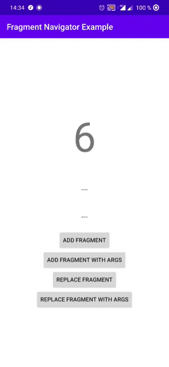
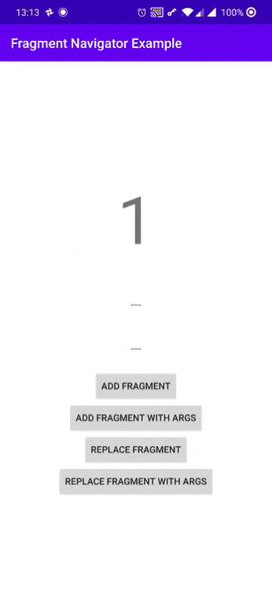

[](https://jitpack.io/#shikleyev/fragula)

# Fragula
A simple and customizable Android fragments navigator with support "swipe to dismiss" gestures and saving a stack of fragments when changing the screen orientation


### Requirements
* A project configured with the AndroidX
* SDK 21 and and higher

### Demo Application
[](https://play.google.com/store/apps/details?id=info.yamm.project2&hl=ru)

(The app requires vk.com registration)

### Install
Download via **Gradle**:

Add this to the **project `build.gradle`** file:
```gradle
allprojects {
    repositories {
        ...
        maven { url "https://jitpack.io" }
    }
}
```

And then add the dependency to the **module `build.gradle`** file:
```gradle
implementation 'com.github.shikleev:fragula:latest_version'
```

### Usage
#### Simple usage
All you need to do is create a Navigator in the xml of your activity:
```xml
<?xml version="1.0" encoding="utf-8"?>
<com.fragula.Navigator
    android:id="@+id/navigator"
    xmlns:android="http://schemas.android.com/apk/res/android"
    xmlns:tools="http://schemas.android.com/tools"
    android:layout_width="match_parent"
    android:layout_height="match_parent"
    tools:context=".MainActivity"/>
```

And init Navigator in your activity:
```kotlin
override fun onCreate(savedInstanceState: Bundle?) {
    super.onCreate(savedInstanceState)
    setContentView(R.layout.activity_main)
    navigator.init(supportFragmentManager)
    if (savedInstanceState == null) {
        navigator.addFragment(BlankFragment())
    }
}
```

#### Passing arguments to a fragment
You can pass an unlimited number of arguments in the function parameters:
```kotlin
navigator.addFragment(
    BlankFragment(),
    Arg(ARG_PARAM1, "Add fragment arg"),
    Arg(ARG_PARAM2, 12345))
```
And get them in an opened fragment:
```kotlin
class BlankFragment : Fragment() {

    private var param1: String? = null
    private var param2: Int? = null

    override fun onCreate(savedInstanceState: Bundle?) {
        super.onCreate(savedInstanceState)
        arguments?.let {
            param1 = it.getString(ARG_PARAM1)
            param2 = it.getInt(ARG_PARAM2)
        }
    }
}
```

#### Replace fragment
```kotlin
navigator.replaceCurrentFragment(newFragment)
```
Or replace by position with arguments
```kotlin
navigator.replaceFragmentByPosition(
   newFragment, 
   position, 
   Arg(ARG_PARAM1, "Replace fragment arg"))
```

#### Intercept events
Intercept the youch event while the fragment transaction is in progress.
In your Activity:
```kotlin
override fun dispatchTouchEvent(ev: MotionEvent?): Boolean {
    return if (navigator.isBlockTouchEvent)
        true
    else
        super.dispatchTouchEvent(ev)
}
```
Intercept onBackPressed:
```kotlin
override fun onBackPressed() {
    if (navigator.fragmentsCount() > 1) {
        navigator.goToPreviousFragmentAndRemoveLast()
    } else {
        super.onBackPressed()
    }
}
```

#### Fragment transition callback
The fragment opening transaction is executed synchronously and starts after onViewCreated finishes in the fragment being torn off. If you have asynchronous code that displays the results in a fragment, this may affect the arbitrariness of the fragment's opening animation. For such cases, you need to use an interface in your fragment that will report that the fragment transaction is complete.
```kotlin
class BlankFragment : Fragment(), OnFragmentNavigatorListener {
    override fun onOpenedFragment() {
        //This is called when the animation for opening a new fragment is complete
    }
    override fun onReturnedFragment() {
        //This will be called when you return to this fragment from the previous one
    }
}
```
You can also use other callbacks:
```kotlin
navigator.onPageScrolled = {position, positionOffset, positionOffsetPixels ->  }

navigator.onNotifyDataChanged = {fragmentCount ->  
// Called after a new fragment is added to the stack or when the fragment is removed from the stack
}

navigator.onPageScrollStateChanged = {state -> 
// SCROLL_STATE_IDLE, SCROLL_STATE_SETTLING, SCROLL_STATE_DRAGGING
}
```

#### Fragment stack
You can get a stack of fragments by accessing the Navigator:
```kotlin
val fragments: ArrayList<Fragment> = navigator.fragments()
```
Or using the Fragment Manager to search for a fragment by tag
(The Navigator assigns a tag to each fragment depending on the position in the Navigator):
```kotlin
val fragment = supportFragmentManager.findFragmentByTag("0")
if (fragment != null && fragment is MainFragment) {
    mainFragment = fragment
}
```

#### Page transformer
Navigator based on ViewPager, so you can use your own PageTransformer:
```kotlin
class CustomPageTransformer: FragmentNavigator.PageTransformer {
    override fun transformPage(page: View, position: Float) {
        page.apply {
            cameraDistance = width * 100f
            pivotY = height / 2f
            when {
                position > 0 && position < 0.99 -> {
                    alpha = 1f
                    rotationY = position * 150
                    pivotX = width / 2f
                }
                position > -1 && position <= 0 -> {
                    alpha = 1.0f - abs(position * 0.7f)
                    translationX = -width * position
                    rotationY = position * 30
                    pivotX = width.toFloat()
                }
            }
        }
    }
}
```
And in your activity:
```kotlin
navigator.setPageTransformer(false, CustomPageTransformer())
```



#### Change the animation duration
```kotlin
navigator.setDurationFactor(1.8f)
```


### Issues
#### 1.
The Navigator cannot delete a fragment in the middle or beginning of the fragment stack. This leads to the violation of the order of the fragments and unexpected errors. Use onBackPressed to delete the last fragment or 
```kotlin
navigator.goToPreviousFragmentAndRemoveLast()
```
If you want to remove the last few fragments, use:
```kotlin
navigator.goToPosition(position)
```
This will also remove all closed fragments from the stack
#### 2.
Gestures conflict when using Motion Layout


If there is a conflict of gestures you can disable the swipe gestures in the Navigator and then turn them back on
```kotlin
MotionLayout.setOnTouchListener { view, motionEvent ->
    when (motionEvent.action) {
        MotionEvent.ACTION_DOWN -> {
            navigator.setAllowedSwipeDirection(SwipeDirection.NONE)
        }
        MotionEvent.ACTION_UP -> {
            navigator.setAllowedSwipeDirection(SwipeDirection.RIGHT)
        }
        MotionEvent.ACTION_CANCEL -> {
            navigator.setAllowedSwipeDirection(SwipeDirection.RIGHT)
        }
    }
    return@setOnTouchListener false
}
```


Also, you can take a look at the [sample project](https://github.com/shikleyev/fragula/tree/master/app) for more information.




